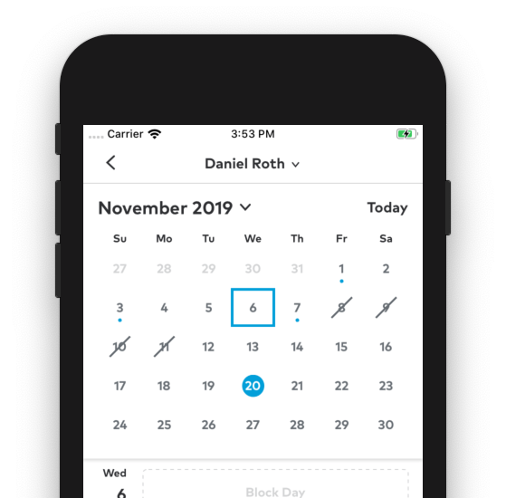

# TTCalendarPicker

<p align="center">
   <a href="./images/thumbtack_demo.png">
      
   </a>
</p>

TTCalendarPicker is a lightweight, highly configurable, infinite scrolling calendar picker view.  TTCalendarPicker was developed by the
iOS teams at Thumbtack, Inc and currently drives our styled calendar picker.  While we are unlikely to add requested features that we
don't plan on using within our own apps, we will be actively fixing bugs as they are found.

## Example

To run the example project, clone the repo then build and run the TTCalendarPicker-Example project.

## Requirements

- iOS 16.0+
- Xcode 16.0+
- Swift 5.10+

## Installation

### Swift Package Manager

[Swift Package Manager](https://swift.org/package-manager/) is a tool for managing the distribution of Swift code. It’s integrated with the Swift build system to automate the process of downloading, compiling, and linking dependencies.

> Xcode 16+ is required to build TTCalendarPicker using Swift Package Manager.

To integrate TTCalendarPicker into your Xcode project using Swift Package Manager, add it to the dependencies value of your `Package.swift`:

```swift
dependencies: [
    .package(url: "https://github.com/thumbtack/TTCalendarPicker.git", .upToNextMajor(from: "0.2.0"))
]
```

# Usage

## Basic Calendar

At a bare minimum, to use TTCalendarPicker you must:

1. Instantiate a `TTCalendarPicker.CalendarPicker` object.  By deafult, the CalendarPicker will use the user's current, locale based calendar.
1. Constrain the calendar so that it has an unambiguous width.  The calendar will constrain it's own height based on it's width, its `calendarHeightMode`, and it's `cellHeightMode`.
1. Provide the calendarPicker with a dataSource object, and register a dateCell class/nib, e.g.:
    ```swift
    calendarPicker.registerDateCell(DateCell.self, withReuseIdentifier: "DateCell")
    ```
1. In the calendarPicker data source, deque and configure a cell for the given date, e.g.:
    ```swift
    func calendarPicker(_ calendarPicker: CalendarPicker, cellForDay day: Int,
                        month: Int, year: Int, inVisibleMonth: Bool, at indexPath: IndexPath) -> UICollectionViewCell {
        let cell = calendarPicker.dequeReusableDateCell(
            withReuseIdentifier: "DateCell",
            indexPath: indexPath)
            as! DateCell
        cell.setText("\(day)")
        cell.isInVisibleMonth = inVisibleMonth
        return cell
    }
    ```
    
## Configuring the Calendar

TTCalendarPicker is highly configurable. Since the date cells and month headers are provided by the devloper, it can support nearly any design you can think of. Additionally, TTCalendarPicker supports the following configuration properties

### previousMonthCount
**Type:** `Int`  
**Default:** `nil`  
The number of months, before the initial month, that the user should be able to scroll to.

### additionalMonthCount
**Type:** `Int`  
**Default:** `nil`  
The number of months, ater the initial month, that the user should be able to scroll to.

### calendarHeightMode
**Type:** `TTCalendarPicker.CalendarHeightMode`  
**Default:** `.fixed`  
- `.fixed`:always shows the maximum number of weeks that can occur in a month
- `.dynamic`: resizes to the height required to show number of weeks in the visible month. 

### cellHeightMode
**Type:** `TTCalendarPicker.CellHeightMode`  
**Default:** `.aspectRatio(0.88)`  
Either `.fixed` (rows have a set height) or `.aspectRatio` (cell height depends on its width).

### gridInsets
**Type:** `UIEdgeInsets`  
**Default:** `UIEdgeInsets(top: 12.0, left: 16.0, bottom: 12.0, right: 16.0)`  
 Insets for the date cell grid
 
### cellSpacingX 
**Type:** `CGFloat`  
**Default:** `1.0`  
Space to insert between columns of dates

### cellSpacingY
**Type:** `CGFloat`  
**Default:** `1.0`   
Space to insert between rows of dates

### monthHeaderHeight:
**Type:** `CGFloat?`  
**Default:** `nil`
Height to allocate for an optional monthHeaderView

### selectedDates: 
**Type:** `[Date]`  
**Default:** `[]`  
The currently selected dates, at midnight in the calendarPicker's calendar

### allowsMultipleSelection
**Type:** `Bool`  
**Default:** `false`  
Whether the selecting additional dates should deselect the previously selected one

### gridColor
**Type:** `UIColor`  
**Default:** `.clear`  
The color of the area defined by `cellSpacingX` and `cellSpacingY` 

## Contributing 

All contributions are welcome, with the caveat that this code is being actively used by a production app, and that it is unlikely we will
commit a change that we don't intend to use or that won't contribute to the stability of the codebase.

## Author

Initial work by Daniel Roth - droth@thumbtack.com,  
with ongoing contributions from the entire iOS team here at Thumbtack.

## License

TTCalendarPicker is available under the Apache 2.0 license. See the LICENSE file for more info.
